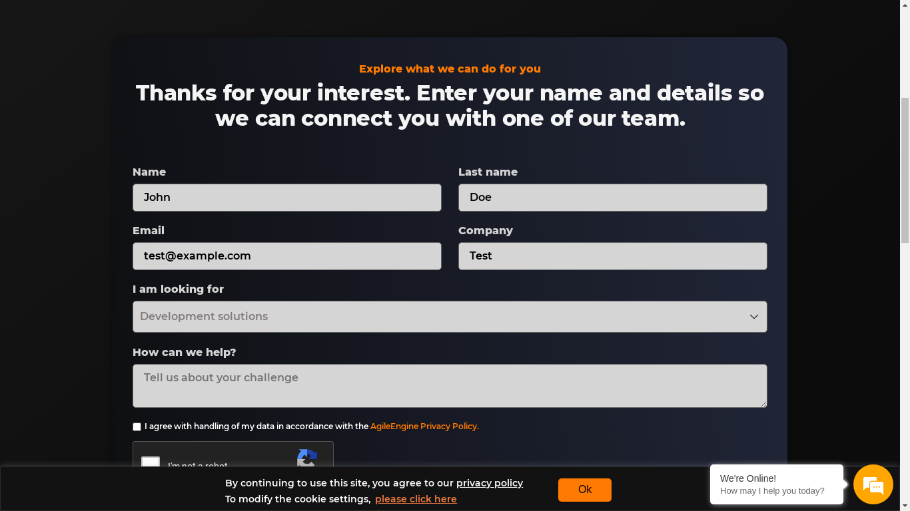
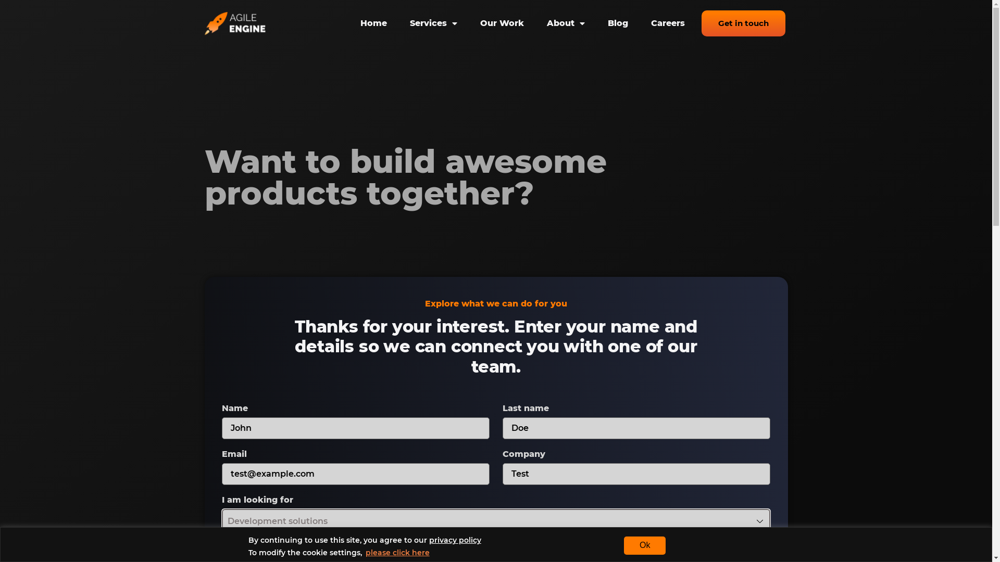

This repo contains two examples for RPA:
- via [Python RPA](https://pypi.org/project/rpa/)
- via [Selenium](https://pypi.org/project/selenium/)

Both examples are filling in the [AgileEngine contact form](https://agileengine.com/get-in-touch/).

# Python RPA
The [root folder](python_rpa) contains a basic script and the example of the filled in form:

# Selenium
The [root folder](selenium) contains a basic project structure and the example of the filled in form:
